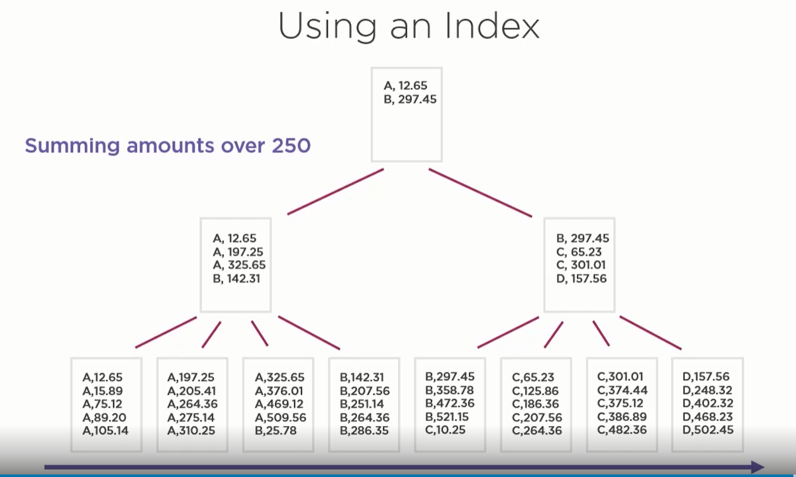

## Indexes
An index is an on-disk structure associated with a table/view that speeds retrieval of rows  
Indexes are special lookup tables that the database search engine can use to speed up data retrieval  

## Creating Indexes

### For New Systems
  - create indexes to support unique requirements
  - create indexes for forieg key columns
  - create indexes to supported common queries
  - be prepared to change indexes later

### For existing systems
  - identify most resource intensive queries
  - identify most important queries
  -  index to support them
  -  re-investigatee regularly

## SQL Server
- Data is stored in 8kb chunks, called pages
- Organized into a key structure (B-tree/Balanced tree)
  
  
  
- Data logically ordered by the index key

## Index operations in execution plans
- Index seek: Navigation down the tree from the root to find a value (single/ range of rows)
  
  
  
- Index scan: Read all are some of the leaf pages (rows read = all rows, actula number of rows = which are greater than 250)

  
  
- Key lookup: Single row seek to the clustered index
  - A process where the respective clustered index key is found in the non-clustered index and the key is looked up in actual table to get other column values 

## Types of Indexes

### Clustered index
- index which defines the physical storage of the table
- one per table (or none - called as heap table)
- should be unique
- clustered index keys are used as a row address in all the other indexes
- reduce updating the clustered index values (as in that case it has to be deleted from one page and should be created in another page)

### Non-clustered index
- Separate structure from the table
- Current is Max 999 indexes
- Always in sync with table (so updating actual data should update this too)
- Predicates
  - Equality predicates (eg: WHERE id = 2 AND age = 23 )

  

  - Inequality predicates (eg: WHERE id = 2 AND age > 23 )
  - Predicates combined with OR (eg: WHERE id = 2 OR age = 23 ) (difficult) (needs multiple indexes for better performance - index interception concept explained below)
  - Indexing for joins (used seldom)

### Covering index ( Index Include Columns )
- A clustered index wherein the other column data are also stored instead of just the addresses
- Consider a non-clustered index has multiple column selection - in that case first a seek is done in non-clustered structure, find the addresses, go to actual table, get the data
- Covering indexes are those, where in when non-clustered structure is created, you can specify the column data that should be copied. So incase of querying, actual read for data doesn't have to go to actual table and instead can be found in the non-clustered structure
- Adds an overhead of syncing the data b/w actual data table and non-clustered structure & data is duplicated

### Indexed views
- Normally views are just saved SELECT statements & a clustered index van be created on a view
- materializes the view (materialized view - persists the data returned from the view definition query - kept in sync with actual table)
- Lot of limitations
  - views should be created with SCHEMABINDING, which has its own complications
  - cannot have SELECT *
  - cannot have sub queries
  - must be INNER JOINS
  - can't reference other VIEWS, only TABLES
  - cannot use MAX(), MIN() but many other functions are supported
  - can use ROW_NUMBER() but without OVER() clause, which is meaningless
  - SELF JOINS are not applied, neither is APPLY, Table valued functions, Unions, distinct OR Grouping sets
  - Certain SET Options are required

### Columnstore indexes
- For analytical queries
- google for more info..

## Reading Execution Plan Parameters
- Number of Rows Read: number of rows the query read (need to read most to check if it is within the quer filters or not)
- Actual number of Rows: number of rows needed (based on the query filters)
- Logical Reads: number of pages read (leaf nodes read)

## Other concepts to explore
- Page Splits: inserting a row which actually should go into a page in b/w and which is full (a new page will be added and the new content along with its continuation row data is added in the new page, and address nodes (intermediate/root) are updated
- Index Intersection 
  - eg:- suppose there are two individual indexes for column1 and column2
  - if my query has a WHERE column1 = '' and column2='', it cannot use any of the idexes
  - instead it queries using both the indexes separately, gets the results
  - and merges it by using the other predicate (condition) (which can be seen as Merge/Nested Loops/etc.. Joins in execution plan)
- JOIN types in execution plan
  - Merge Joins (forcing a query to use - INNER MERGE JOIN)
  - Hash Joins (forcing a query to use - INNER HASH JOIN)
  - nested Loop Joins
  - etc.. 
- Filtered Indexes

